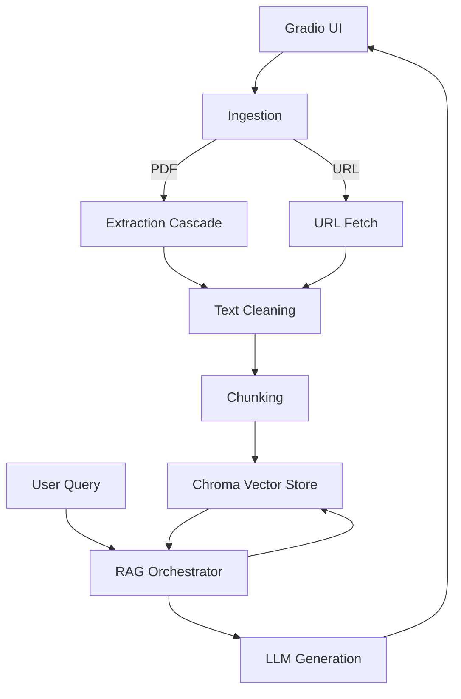
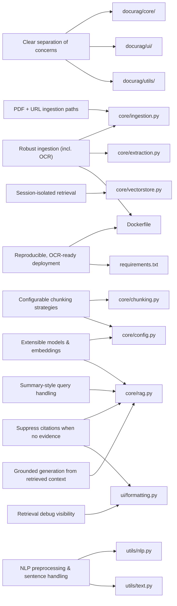

<a name="top"></a>
# 📄 DocuRAG — Document Retrieval‑Augmented Generation (RAG)

DocuRAG is a **production‑style, modular Retrieval‑Augmented Generation (RAG) system** designed to demonstrate how modern LLM applications retrieve, ground, and generate answers over **user‑supplied documents** — *without LangChain*.

It is built to showcase **applied ML, NLP, and systems design skills** relevant to real‑world RAG deployments.

---

## 📑 Contents 

- [Project Overview](#project-overview)
- [Architecture Overview](#architecture-overview)
- [System Overview](#system-overview)
- [Codebase Structure](#codebase-structure)
- [Core Functionalities](#core-functionalities)
- [Key Design Goals](#key-design-goals)
- [Failure Modes & Safeguards](#failure-modes--safeguards)
- [Design Goals → Code Mapping](#design-goals--code-mapping)
  - [Implementation Map](#design-goals--implementation-map)
- [Running DocuRAG](#running-docurag)
  - [Local Setup](#run-locally)
  - [Docker Deployment](#run-with-docker)
  - [Hugging Face Spaces](#run-on-hugging-face-spaces)
- [Testing PDFs](#testing-pdfs)
- [License](#license)

---

## 🚀 Project Overview

DocuRAG enables users to ask natural‑language questions over custom knowledge sources provided via:

- 📂 **Local PDF upload**
- 🌐 **URL ingestion** (automatic fetch + processing)

The system retrieves the most relevant document segments using **vector similarity search (Chroma)** and generates **context‑grounded answers** using an LLM, with optional **summary‑style responses** when intent is detected.

---

## 🚀 Live Demo

[](https://huggingface.co/spaces/oizima/docurag)

---

## 🏗️ Architecture Overview



---

## System Overview

DocuRAG is a modular, document-grounded RAG system built around a clear separation of concerns across [`docurag/core/`](docurag/core/), [`docurag/ui/`](docurag/ui/), and [`docurag/utils/`](docurag/utils/) modules (see the table below, [Design Goals → Code Mapping](#design-goals--code-mapping)). It supports both local PDF uploads and URL-based ingestion via [`docurag/core/ingestion.py`](docurag/core/ingestion.py), extracts text using a resilient `fitz → pdfplumber → OCR` cascade in [`docurag/core/extraction.py`](docurag/core/extraction.py), and ensures session-isolated retrieval through [`docurag/core/vectorstore.py`](docurag/core/vectorstore.py) to prevent data leakage. Query-time behavior is orchestrated in [`docurag/core/rag.py`](docurag/core/rag.py), including intent-aware handling for summarization-style prompts (e.g., “main contributions”) and safe fallbacks that suppress citations when no relevant evidence is retrieved, while [`docurag/ui/formatting.py`](docurag/ui/formatting.py) provides transparent citations and retrieval debug views. The full stack is designed for reproducible deployment with OCR enabled, using the [`Dockerfile`](Dockerfile) and [`requirements.txt`](requirements.txt) to keep runtime behavior consistent across local runs and Hugging Face Spaces.

## 🧩 Codebase Structure

```text
docurag/
├─ docurag/
│  ├─ core/
│  │  ├─ config.py        # environment + settings
│  │  ├─ ingestion.py     # PDF / URL ingestion
│  │  ├─ extraction.py    # fitz → pdfplumber → OCR cascade
│  │  ├─ chunking.py      # word / sentence / auto
│  │  ├─ vectorstore.py   # per‑session Chroma
│  │  └─ rag.py           # indexing, retrieval, generation
│  ├─ ui/
│  │  ├─ formatting.py    # citations + debug output
│  │  └─ gradio_app.py    # Gradio UI
│  └─ utils/
│     ├─ text.py          # text cleaning
│     └─ nlp.py           # NLTK helpers
├─ app.py                 # HF Spaces entry point
├─ Dockerfile             # includes tesseract‑ocr
├─ requirements.txt
├─ pyproject.toml
├─ .env.example
└─ README.md
```

---
## ✨ Core Functionalities (What This System Demonstrates)

This project intentionally mirrors decisions made in real applied‑AI systems.

### 📄 Document Ingestion
- Upload **native or scanned PDFs**
- Ingest **web content via URL**
- Metadata preservation for citations

### 🔍 Robust Text Extraction
- **Cascade extraction strategy**:
  1. PyMuPDF (`fitz`) — fast, native PDFs
  2. pdfplumber — complex layouts
  3. OCR fallback (Tesseract) — scanned documents

### ✂️ Intelligent Chunking
- Word‑window chunking with overlap
- Sentence‑based chunking (NLTK)
- **Auto mode** that adapts to document size

### 🧠 Retrieval‑Augmented Generation
- Session‑scoped **Chroma vector stores**
- Top‑K similarity retrieval
- Context‑bounded prompting
- **Summary‑intent detection** vs QA routing

### 🧾 Traceability & Citations
- Page‑level source attribution
- Optional debug traces
- Clean formatting for UI display

### 🖥️ Deployment‑Ready UI, Docker & OCR Support (Tesseract)
- Gradio interface
- Local, Docker, and Hugging Face Spaces support
- Robust document extraction cascade (`docurag/core/extraction.py`):
  - **PyMuPDF (`fitz`) → pdfplumber → OCR fallback**

This design matters because **many real-world PDFs are scanned images**, not “true text” PDFs.  
When a document contains only images, standard text extraction returns little or nothing — so the system **automatically falls back to OCR**.

---

## 🎯 Key Design Goals
- **Clear separation of concerns:**
Each stage of the RAG pipeline (ingestion, extraction, chunking, retrieval, generation, and UI) is isolated into well-defined modules, improving readability, testability, and long-term maintainability.

- **Robust document ingestion with OCR support:**
Documents are processed using a resilient extraction cascade (native PDF parsing → layout-aware extraction → OCR fallback), ensuring both digital and scanned PDFs are handled reliably.

- **Session-isolated retrieval to prevent data leakage:**
Each user session operates on its own vector store instance, preventing cross-document or cross-user contamination during retrieval and generation.

- **Extensibility across models and embedding providers:**
LLMs and embedding models are configured via environment settings, making it easy to swap providers or models without changing core logic.

- **Multiple ingestion paths (local files + URLs):**
Users can upload PDFs from their local machine or provide a URL, both routed through the same downstream processing and indexing pipeline.

- **Adaptive question handling beyond fact lookup:**
    
    The system is designed to generalize beyond narrow fact-based queries and handle higher-level intents such as:
    
    - *“What are the main contributions of this paper?”*
    - *“Provide a summary of the document.”*
        
        Query intent is detected and routed appropriately, ensuring meaningful responses even when answers span multiple sections.

- **Graceful handling of low-relevance or missing context**
    
    When retrieval yields no relevant chunks, the system avoids misleading responses and:
    
    - returns a clear, user-friendly message
    - suppresses citations when no supporting content exists
        
        This prevents false attribution and improves trust in the system’s outputs.
- **Configurable chunking and retrieval strategies:**
Chunking mode (auto, sentence-based, or word-window) and retrieval depth (Top-K) are exposed as configurable parameters to support different document types and query behaviors.

- **Grounded generation with explicit source attribution:**
Answers are generated strictly from retrieved document context and returned with citations (source and page), reducing hallucination and improving transparency.

- **Docker-first deployment for reproducibility:**
The application is designed to run consistently across local environments, Hugging Face Spaces, and other platforms using Docker, including all system-level dependencies.

- **OCR-ready containerized runtime:**
The Docker image includes tesseract-ocr, ensuring OCR functionality works reliably in cloud and containerized deployments without additional setup.

- **Minimal framework coupling:**
The RAG pipeline is implemented without heavy orchestration frameworks, keeping the logic explicit, debuggable, and easy to reason about.

---

## 🛡️ Failure Modes & Safeguards

DocuRAG is designed to handle common failure modes in document-centric RAG systems gracefully, prioritizing correctness, transparency, and user trust.

- **Scanned or image-only PDFs**
    
    *Failure mode:* Native text extraction returns empty or unusable content.
    
    *Safeguard:* A multi-stage extraction cascade (`fitz → pdfplumber → OCR`) automatically falls back to OCR when required, ensuring text is extracted even from scanned documents (`core/extraction.py`).
    
- **Empty or low-relevance retrieval results**
    
    *Failure mode:* The retriever returns no chunks relevant to the user’s question.
    
    *Safeguard:* The system avoids hallucination by returning a clear message indicating insufficient context and suppresses citations when no supporting evidence exists (`core/rag.py`, `ui/formatting.py`).
    
- **Overly narrow or overly broad chunking**
    
    *Failure mode:* Poor chunk boundaries lead to incomplete or noisy context.
    
    *Safeguard:* Multiple chunking strategies (auto, sentence-based, word-window) are supported, allowing the system to adapt chunk granularity to document structure (`core/chunking.py`).
    
- **High-level or abstract queries**
    
    *Failure mode:* Questions such as *“What are the main contributions of this paper?”* fail because answers span multiple sections.
    
    *Safeguard:* Query intent detection routes summarization-style questions through a dedicated path that aggregates broader context rather than relying on a single chunk (`core/rag.py`).
    
- **Cross-session data leakage**
    
    *Failure mode:* Retrieved context from a previous document appears in a new session.
    
    *Safeguard:* Each session uses an isolated Chroma vector store instance, and resets are enforced when new documents are ingested (`core/vectorstore.py`).
    
- **Misleading or fabricated citations**
    
    *Failure mode:* Citations are shown even when no document content supports the answer.
    
    *Safeguard:* Citations are generated strictly from retrieved metadata and are omitted entirely when no relevant context is found (`ui/formatting.py`).
    
- **Environment inconsistency across deployments**
    
    *Failure mode:* OCR or NLP components work locally but fail in cloud environments.
    
    *Safeguard:* Docker-based deployment packages all system dependencies (including Tesseract OCR), ensuring consistent behavior across local runs and Hugging Face Spaces (`Dockerfile`).

---

## Design Goals → Code Mapping

The table below maps DocuRAG’s key design goals directly to the modules that enforce them.

> Note: Links are relative to the repo root.

| Design Goal | Enforced By |
|------------|-------------|
| Clear separation of concerns | [`docurag/core/`](docurag/core/) · [`docurag/ui/`](docurag/ui/) · [`docurag/utils/`](docurag/utils/) |
| Robust document ingestion with OCR | [`docurag/core/ingestion.py`](docurag/core/ingestion.py) · [`docurag/core/extraction.py`](docurag/core/extraction.py) · [`Dockerfile`](Dockerfile) |
| Session-isolated retrieval | [`docurag/core/vectorstore.py`](docurag/core/vectorstore.py) |
| Extensible models & embeddings | [`docurag/core/config.py`](docurag/core/config.py) · [`docurag/core/rag.py`](docurag/core/rag.py) |
| Multiple ingestion paths (PDF + URL) | [`docurag/core/ingestion.py`](docurag/core/ingestion.py) |
| Adaptive handling of summary-style queries | [`docurag/core/rag.py`](docurag/core/rag.py) *(see `is_summary_intent`, summary routing)* |
| Suppression of citations when no evidence exists | [`docurag/core/rag.py`](docurag/core/rag.py) · [`docurag/ui/formatting.py`](docurag/ui/formatting.py) |
| Grounded generation from retrieved context only | [`docurag/core/rag.py`](docurag/core/rag.py) |
| Configurable chunking strategies | [`docurag/core/chunking.py`](docurag/core/chunking.py) · [`docurag/core/config.py`](docurag/core/config.py) |
| NLP preprocessing & sentence handling | [`docurag/utils/nlp.py`](docurag/utils/nlp.py) · [`docurag/utils/text.py`](docurag/utils/text.py) |
| Reproducible, OCR-ready deployment | [`Dockerfile`](Dockerfile) · [`requirements.txt`](requirements.txt) |
| Debuggability of retrieval behavior | [`docurag/ui/formatting.py`](docurag/ui/formatting.py) *(retrieval debug output)* |

### Design Goals → Implementation Map


---

## ▶️ Running DocuRAG

### 🖥️ Run Locally (Recommended for Development)
#### Clone the Repository
```bash
git clone https://github.com/o-izima/DocuRAG.git
cd DocuRAG
```

### Create and Configure `.env`

```bash
cp .env.example .env
```

Edit `.env` and set at least:

```bash
OPENAI_API_KEY=your_api_key_here
MODEL_NAME=your_llm_model_name
EMBEDDING_MODEL_NAME=your_embedding_model_name
```
Optional but recommended (tune retrieval behavior):

```bash
CHUNK_SIZE=500
CHUNK_OVERLAP=50
TOP_K=5
```
You may also configure additional retrieval or chunking parameters depending on your use case.

#### Using `pip`
```bash

```bash
python -m venv .venv
source .venv/bin/activate      # macOS / Linux
# .\.venv\Scripts\activate     # Windows PowerShell
pip install -r requirements.txt
```

Start the Gradio UI:

```bash
python -m docurag.ui.gradio_app
```

If your repository includes the helper script, you can also run:

```bash
bash scripts/run_gradio.sh

```
Then open:

```bash
http://localhost:7860
```

---

### 🐳 Run with Docker (Best for OCR Reliability)

```bash
docker build -t docurag .
docker run -p 7860:7860 --env-file .env docurag
```
Then open:

```bash
http://localhost:7860
```

✅ Docker is strongly recommended if you plan to ingest scanned PDFs, since tesseract-ocr is guaranteed to be available inside the container.

---

### 🤗 Run on Hugging Face Spaces

#### Typical Hugging Face Spaces Setup (Docker Space)

1. Create a new Space on Hugging Face  
2. Select **Docker** as the Space SDK  
3. Connect this repository *or* push the code directly  
4. Add environment variables in the Space settings:

```bash
OPENAI_API_KEY=your_api_key_here
MODEL_NAME=your_llm_model_name
EMBEDDING_MODEL_NAME=your_embedding_model_name
TOP_K=5
CHUNK_SIZE=500
```

Hugging Face will:
- build the Docker image
- install dependencies (including OCR)
- host the Gradio app automatically

⚠️ If you rely on OCR in Spaces, Docker-based deployment is strongly recommended so that Tesseract is available at runtime.

---

## Quick testing PDFs

Use these in the URL field or download the files to your local computer:

- https://arxiv.org/pdf/1706.03762.pdf (Transformers)

- https://arxiv.org/pdf/2501.12948.pdf (DeepSeek-R1)

Try:

- “What is self-attention?”

- “Summarize the paper / main contributions”

---

## License

This project is licensed under the [MIT License](./LICENSE). See the LICENSE file for details.

[⬆ Go to Top](#top)

---

