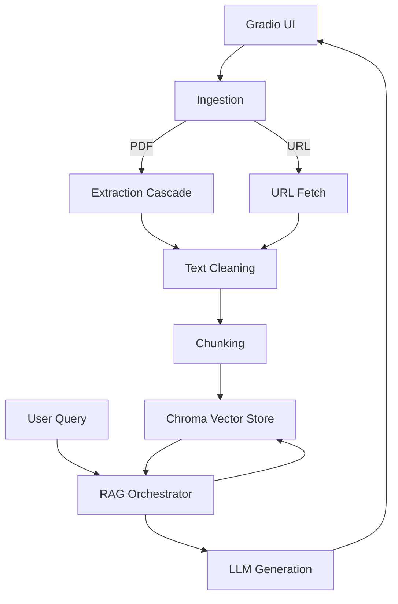

# 📄 DocuRAG — Document Retrieval‑Augmented Generation (RAG)

DocuRAG is a **production‑style, modular Retrieval‑Augmented Generation (RAG) system** designed to demonstrate how modern LLM applications retrieve, ground, and generate answers over **user‑supplied documents** — *without LangChain*.

It is built to showcase **applied ML, NLP, and systems design skills** relevant to real‑world RAG deployments.

---

## 🚀 Project Overview

DocuRAG enables users to ask natural‑language questions over custom knowledge sources provided via:

- 📂 **Local PDF upload**
- 🌐 **URL ingestion** (automatic fetch + processing)

The system retrieves the most relevant document segments using **vector similarity search (Chroma)** and generates **context‑grounded answers** using an LLM, with optional **summary‑style responses** when intent is detected.

Key design goals:
- Clear separation of concerns
- Extensibility across models and embeddings
- Robust document ingestion (including OCR)
- Session‑isolated retrieval to avoid data leakage

---


## 🏗️ Architecture Overview



---

## 🧩 Codebase Structure

```text
docurag/
├─ docurag/
│  ├─ core/
│  │  ├─ config.py        # environment + settings
│  │  ├─ ingestion.py     # PDF / URL ingestion
│  │  ├─ extraction.py    # fitz → pdfplumber → OCR cascade
│  │  ├─ chunking.py      # word / sentence / auto
│  │  ├─ vectorstore.py   # per‑session Chroma
│  │  └─ rag.py           # indexing, retrieval, generation
│  ├─ ui/
│  │  ├─ formatting.py    # citations + debug output
│  │  └─ gradio_app.py    # Gradio UI
│  └─ utils/
│     ├─ text.py          # text cleaning
│     └─ nlp.py           # NLTK helpers
├─ app.py                 # HF Spaces entry point
├─ Dockerfile             # includes tesseract‑ocr
├─ requirements.txt
├─ pyproject.toml
├─ .env.example
└─ README.md
```

---


## ✨ Core Functionalities (What This System Demonstrates)

This project intentionally mirrors decisions made in real applied‑AI systems.

### 📄 Document Ingestion
- Upload **native or scanned PDFs**
- Ingest **web content via URL**
- Metadata preservation for citations

### 🔍 Robust Text Extraction
- **Cascade extraction strategy**:
  1. PyMuPDF (`fitz`) — fast, native PDFs
  2. pdfplumber — complex layouts
  3. OCR fallback (Tesseract) — scanned documents

### ✂️ Intelligent Chunking
- Word‑window chunking with overlap
- Sentence‑based chunking (NLTK)
- **Auto mode** that adapts to document size

### 🧠 Retrieval‑Augmented Generation
- Session‑scoped **Chroma vector stores**
- Top‑K similarity retrieval
- Context‑bounded prompting
- **Summary‑intent detection** vs QA routing

### 🧾 Traceability & Citations
- Page‑level source attribution
- Optional debug traces
- Clean formatting for UI display

### 🖥️ Deployment‑Ready UI
- Gradio interface
- Local, Docker, and Hugging Face Spaces support

---

## 🐳 Docker & OCR Support (Tesseract)

DocuRAG implements a **robust document extraction cascade** (`docurag/core/extraction.py`):

**PyMuPDF (`fitz`) → pdfplumber → OCR fallback**

This design matters because **many real-world PDFs are scanned images**, not “true text” PDFs.  
When a document contains only images, standard text extraction returns little or nothing — so the system **automatically falls back to OCR**.

### Why Tesseract is included in Docker

The provided `Dockerfile` installs **`tesseract-ocr`** to ensure:

- ✅ Reliable OCR in containerized deployments  
- ✅ Consistent behavior across OS environments  
- ✅ No “works on my machine” extraction failures  
- ✅ True document intelligence for scanned PDFs  

This is especially important for **production and Hugging Face Spaces deployments**.

----

## ▶️ Running DocuRAG

### 1️⃣ Clone the Repository
```bash
git clone https://github.com/o-izima/DocuRAG.git
cd DocuRAG

## 2️⃣ Create and Configure `.env`

```bash
cp .env.example .env

Edit `.env` and set at least:

OPENAI_API_KEY=your_api_key_here
MODEL_NAME=your_llm_model_name
EMBEDDING_MODEL_NAME=your_embedding_model_name

## 🖥️ Run Locally

```bash
git clone https://github.com/oizima/docurag.git
cd docurag

python -m venv .venv
source .venv/bin/activate
pip install -r requirements.txt

cp .env.example .env
python app.py
```

Open: http://localhost:7860

---

## 🐳 Docker

```bash
docker build -t docurag .
docker run -p 7860:7860 --env-file .env docurag
```

---

## 🤗 Hugging Face Spaces

```bash
git clone https://huggingface.co/spaces/oizima/docurag
cd docurag
git add .
git commit -m "Deploy DocuRAG"
git push
```

The Space will automatically build and launch the Gradio app.

---

## 📜 License

MIT License.

---

